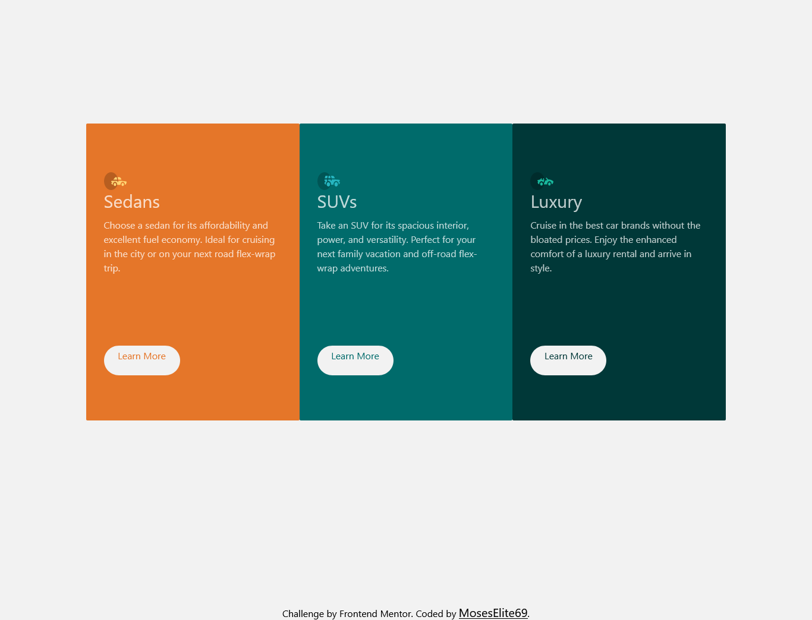

# Frontend Mentor - 3-column preview card component solution

This is a solution to the [3-column preview card component challenge on Frontend Mentor](https://www.frontendmentor.io/challenges/3column-preview-card-component-pH92eAR2-). Frontend Mentor challenges help you improve your coding skills by building realistic projects. 

## Table of contents

- [Overview](#overview)
  - [Screenshot](#screenshot)
  - [Links](#links)
- [My process](#my-process)
  - [Built with](#built-with)
- [Author](#author)

## Overview

### Screenshot

### Links

- Solution URL: [Solution URL here](https://github.com/MosesElite69/3-column-stuff)
- Live Site URL: [Live site URL here](https://eclectic-lily-5f233b.netlify.app)

## My process

### Built with

- Semantic HTML5 markup
- CSS custom properties
- Flexbox
- CSS Grid
- Mobile-first workflow
- [React](https://reactjs.org/) - JS library
- [TailwindCSS](https://tailwindcss.com/) - For styles

## Author

- Frontend Mentor - MosesElite69-(https://www.frontendmentor.io/profile/MosesElite69)
- Twitter/X-(https://twitter.com/RealMosesElite)
- Instagram-(https://www.instagram.com/moses_elite2020)
- Facebook-(https://www.facebook.com/elliot.moses.568)
- LinkedIn - (https://www.linkedin.com/in/elliot-moses-17a444296/)